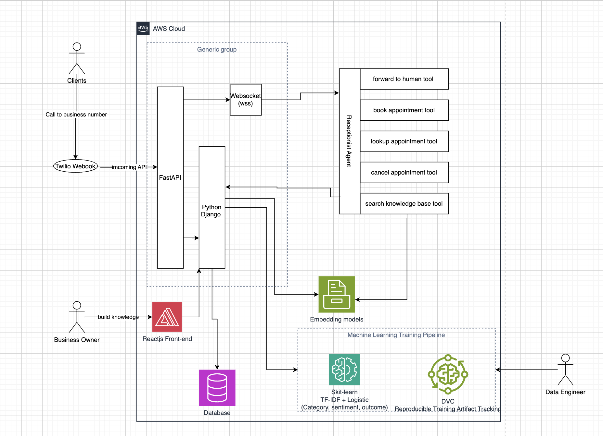

# GROUP 5 - CSCN8010 Final Project

## - Minh Thuan (8730956)

## - Preeja Anilal (8791796)

## - Anthony Nosa Izevbokun (9016626)

### [https://github.com/thuan20132000/ai-service-contestoga.git](https://github.com/thuan20132000/ai-service-contestoga.git)

# 🤖 Smart AI Receptionist

### Real-Time Voice Intelligence Powered by OpenAI Agents SDK & Twilio

---

## Executive Summary

The **Smart AI Receptionist** is a production-grade, real-time voice AI system that answers incoming phone calls, understands caller intent, detects emotional distress, and either resolves queries autonomously or escalates to a human agent. It is built on a dual-server architecture — a **FastAPI voice layer** for real-time telephony and a **Django API** as the business logic backbone — bridged by the **OpenAI Agents SDK**.

> **The system doesn't just talk. It listens, understands, classifies, and decides.**

---

## Table of Contents

1. [System Architecture Overview](#system-architecture-overview)
2. [Deliverable 1 — NLP Model for Query Processing](#deliverable-1--nlp-model-for-query-processing)
3. [Deliverable 2 — Hybrid Post-Call Classification (LLM + ML)](#deliverable-2--hybrid-post-call-classification-llm--ml)
4. [Deliverable 3 — Distress Detection & Escalation Model](#deliverable-3--distress-detection--escalation-model)
5. [Deliverable 4 — Response Generator & Off-Ramp Logic](#deliverable-4--response-generator--off-ramp-logic)
6. [Deliverable 5 — DVC-Orchestrated ML Pipeline](#deliverable-5--dvc-orchestrated-ml-pipeline)
7. [Technology Stack](#technology-stack)
8. [Data Flow: End-to-End Call Lifecycle](#data-flow-end-to-end-call-lifecycle)
9. [Deployment & Infrastructure](#deployment--infrastructure)

---

## System Architecture Overview

```
Caller (Phone)
     │
     ▼
[ Twilio PSTN / Voice ]
     │  (audio stream via WebSocket)
     ▼
[ FastAPI Server ]  ←── Real-time voice layer
     │  (REST API calls)
     ▼
[ OpenAI Agents SDK ]
     │  (orchestration + tool calls)
     ▼
[ Django API ]  ←── Business logic, database, agent tools
     │
     ▼
[ PostgreSQL / Data Store ]
```





The system operates as two cooperating servers:

- **FastAPI** handles the low-latency WebSocket connection from Twilio, streams audio to OpenAI's Realtime API, and manages session state.
- **Django** acts as the authoritative backend: it stores conversation history, exposes tool endpoints that the agent calls (e.g., `lookup_appointment`, `create_ticket`), and manages escalation workflows.

---

## Deliverable 1 — NLP Model for Query Processing

### What It Does

The NLP layer is the **first point of intelligence** in the pipeline. The moment a caller's speech is transcribed (via OpenAI Whisper / Realtime API), the text is passed through a natural language processing pipeline to extract structured meaning before any decision-making occurs.

### Core Components

**Intent Recognition**
The NLP model identifies *what the caller wants* — their primary intent. Examples:

- `general_question` — "What are your hours?"

**Named Entity Recognition (NER)**
Key entities are extracted from the utterance to parameterize the response:

- **Person names** — "My name is John Smith"
- **Dates & times** — "Next Tuesday at 3pm"
- **Account or reference numbers** — "My order number is 84521"
- **Locations** — "The downtown branch"

**Slot Filling & Context Tracking**
Multi-turn conversations require the model to maintain a *dialogue state* — remembering what has already been said so it can ask targeted follow-up questions rather than re-asking for information already provided.

### Implementation Approach

```python
# Simplified NLP pipeline within the agent tool call
def process_query(transcript: str, context: dict) -> dict:
    intent = classify_intent(transcript)          # Intent classification
    entities = extract_entities(transcript)        # SpaCy / OpenAI function calling
    slots = fill_slots(intent, entities, context)  # Dialogue state manager
    return {"intent": intent, "entities": entities, "slots": slots}
```

The NLP layer is embedded directly into the **OpenAI Agents SDK tool definitions**, where function-calling acts as the structured extraction mechanism — the LLM both understands and formats output simultaneously.

An handler is used to collect the NER entities and saved to our database. see code below 

```python

    async def _realtime_session_loop(self) -> None:
        """Receive events from OpenAI RealtimeSession and forward audio to Twilio."""
        try:
            async for event in self._session:
                event_type = event.type

                if event_type == "audio":
                    await self._handle_audio_event(event)

                elif event_type == "audio_interrupted":
                    await self._handle_interruption()

                elif event_type == "audio_end":
                    pass

                elif event_type == "history_updated":
                    await self._handle_history_updated(event)

                elif event_type == "history_added":
                    pass  # handled via history_updated which has transcripts

                elif event_type == "agent_end":
                    logger.info("Agent ended session")

                elif event_type == "error":
                    logger.error(f"Realtime session error: {event.error}")

        except asyncio.CancelledError:
            pass
        except Exception as e:
            logger.error(f"Error in realtime session loop: {e}")
        finally:
            self._done_event.set()
```

---

## Deliverable 2 — Hybrid Post-Call Classification (LLM + ML)

### What It Does

Our production flow now supports **two analysis backends** for post-call classification after the call ends:

- **LLM backend (`openai`)** for rich semantic analysis
- **ML backend (`ml`)** using locally trained sklearn models

Both backends return the same structured fields and populate:

- `outcome` (`successful` | `unsuccessful` | `unknown`)
- `sentiment` (`positive` | `negative` | `neutral`)
- `category` (`make_appointment` | `cancel_appointment` | `reschedule_appointment` | `ask_question` | `unknown`)
- `summary`

```python
# ai_service/services/call_session_service.py (simplified)
if settings.call_analysis_backend == "ml":
    outcome = analyze_conversation_ml(conversation_transcript)
else:
    outcome = await self._openai_service.analyze_conversation(conversation_transcript)
```

### Why This Design

- Keeps the real-time voice path lightweight
- Enables **predictive ML capability** required by the course
- Allows A/B comparison between LLM and classic ML results
- Improves transparency for model behavior and reproducibility


---

## Deliverable 3 — Distress Detection & Escalation Model(this is not impleted yet on our project)

### What It Does

The distress detection model is a **parallel, always-running analysis layer** that monitors every caller utterance for signals of emotional distress, urgency, or vulnerability — independent of intent classification. When triggered, it overrides the standard response pathway and activates an escalation protocol.

### Signal Detection Layers

**Lexical Signals — What words are used**

- High-urgency vocabulary: "emergency," "crisis," "can't breathe," "help me"
- Frustration markers: "this is unacceptable," "I've called ten times," "nobody helps"
- Vulnerability language: "I don't know what to do," "I'm at my wit's end"

**Acoustic / Prosodic Signals — How it's said**
Via the OpenAI Realtime API's audio stream analysis:

- Speech rate acceleration (talking faster than baseline)
- Elevated pitch / vocal tension
- Irregular pauses or voice breaks
- Crying or heavy breathing detected in audio stream

**Sentiment & Emotional State Tracking**
A rolling sentiment window tracks emotional trajectory across the conversation:

```
Turn 1:  Sentiment = Neutral (0.5)
Turn 2:  Sentiment = Mildly Frustrated (0.35)
Turn 3:  Sentiment = Distressed (0.15)  → ESCALATION THRESHOLD CROSSED
```

### Escalation Decision Matrix


| Distress Score | Sentiment Score | Wait Time | Action                                   |
| -------------- | --------------- | --------- | ---------------------------------------- |
| < 0.3          | > 0.5           | Any       | Normal AI response                       |
| 0.3 – 0.6      | 0.3 – 0.5       | < 5 min   | Empathetic response + offer human        |
| > 0.6          | < 0.3           | Any       | **Hard escalation: live transfer**       |
| > 0.8          | Any             | Any       | **Emergency escalation: priority queue** |


### Escalation Activation

```python
async def check_distress(transcript: str, audio_features: dict, history: list) -> EscalationDecision:
    distress_score = distress_model.predict(transcript, audio_features)
    sentiment_trajectory = sentiment_tracker.get_trajectory(history)
    
    if distress_score > HARD_ESCALATION_THRESHOLD:
        await trigger_live_transfer(priority="HIGH")
        return EscalationDecision(action="HARD_HANDOFF", reason="distress_detected")
    elif distress_score > SOFT_ESCALATION_THRESHOLD:
        return EscalationDecision(action="OFFER_HUMAN", reason="elevated_distress")
    
    return EscalationDecision(action="CONTINUE", reason="within_normal_range")
```

This model runs **asynchronously and in parallel** with the main response generation — it never adds latency to the conversation but can interrupt the response pipeline at any point.

---

## Deliverable 4 — Response Generator & Off-Ramp Logic(this is not yet implemented on our project)

### What It Does

The response layer is where the AI formulates its reply and decides which **off-ramp pathway** to execute — whether to continue the conversation, transfer to a human, schedule a callback, or gracefully end the call.

### Response Generation

The response generator uses the **OpenAI Realtime API** for sub-200ms, streaming text-to-speech output, ensuring natural conversational pacing. Responses are shaped by:

- **Tone calibration** — Professional, warm, and empathetic; adjusted dynamically based on distress signals
- **Template anchoring** — Core information (hours, policies, procedures) is retrieved from Django via tool calls, ensuring factual accuracy
- **Persona consistency** — The agent maintains a consistent name, personality, and communication style across the entire call

```python
# Response shaping based on context
def shape_response(intent_result, distress_level, tool_output):
    tone = "empathetic" if distress_level > 0.4 else "professional"
    return ResponseConfig(
        tone=tone,
        max_tokens=150,           # Keep responses concise for voice
        include_confirmation=True, # Repeat key info back to caller
        offer_followup=True
    )
```

### Off-Ramp Logic

Off-ramps are the **exit pathways** out of the AI conversation. Each off-ramp is a deliberate, structured transition with full context preservation so the receiving party (human agent, callback system, CRM) inherits the complete conversation state.

**Off-Ramp 1: Self-Resolution**
The most common pathway. The AI fully handles the request and ends the call gracefully.

```
Caller: "What are your opening hours?"
AI: Retrieves hours via tool call → Answers → Confirms → "Is there anything else I can help you with?" → Call concluded
```

**Off-Ramp 2: Warm Transfer (Soft Handoff)**
The AI has partially resolved the query but determines a human should complete it. The AI briefs the human agent with a summary before connecting.

```
Trigger conditions: Caller explicitly requests human | Complex billing dispute | Unanswered after 2 clarification attempts
Action: AI says "I'm going to connect you with one of our specialists — I'll let them know what we've discussed" → Twilio conference join → Summary pushed to agent CRM screen
```

**Off-Ramp 3: Scheduled Callback**
When wait times are long or caller prefers not to wait. The AI collects callback details and creates a task in Django.

```
Action: Collect name, phone, preferred time → POST /api/callbacks/ in Django → Confirm back to caller → Graceful end
```

**Off-Ramp 4: Emergency Escalation**
Triggered exclusively by the distress detection model. Bypasses all queues.

```
Action: Immediate priority transfer → Alert pushed to supervisor → Full transcript + audio clip flagged for review → Compliance log entry created
```

**Off-Ramp 5: Graceful Deflection**
For out-of-scope requests (legal, medical advice, competitor comparisons). The AI declines politely and redirects.

```
Trigger: Out-of-scope intent detected with confidence > 0.85
Action: "That's not something I'm able to help with, but here's how you can reach the right resource..." → Provide contact info → End call
```

### Off-Ramp State Machine

```
                    ┌─────────────────┐
                    │   Conversation  │
                    │     Active      │
                    └────────┬────────┘
                             │
              ┌──────────────┼──────────────┐
              │              │              │
      Resolved?        Distress?      Unresolvable?
              │              │              │
              ▼              ▼              ▼
     Self-Resolution   Emergency      Warm Transfer
          (End)       Escalation      or Deflection
                         (Transfer)      (Redirect)
                                │
                         Callback
                         Offered?
                                │
                         Scheduled
                         Callback
                           (End)
```

---

## Deliverable 5 — DVC-Orchestrated ML Pipeline

### Pipeline Objective

We implemented a reproducible ML pipeline for post-call analysis using **DVC**, aligned with course requirements for software engineering + data science integration.

### Implemented Assets

- `dvc.yaml` — defines stage `train_post_call_models`
- `params.yaml` — model/training parameters (`test_size`, `max_features`, `ngram_max`, etc.)
- `data/call_intent/training.csv` — labeled training dataset
- `ml/scripts/train_intent_model.py` — training entrypoint
- `ml/artifacts/post_call_models.joblib` — serialized sklearn pipelines
- `ml/artifacts/metrics.json` — classification metrics output

### Stage Definition

```yaml
stages:
  train_post_call_models:
    cmd: python ml/scripts/train_intent_model.py
    deps:
      - ml/scripts/train_intent_model.py
      - data/call_intent/training.csv
    params:
      - params.yaml:
          - train_intent
    outs:
      - ml/artifacts/post_call_models.joblib
      - ml/artifacts/metrics.json
```

### Model Design

We train 3 TF-IDF + Logistic Regression pipelines:

1. `category` classifier
2. `sentiment` classifier
3. `outcome` classifier

This gives a practical, explainable baseline with fast inference and low operational cost.

### Reproducibility Commands

```bash
# Run pipeline
dvc repro

# Check stage/output status
dvc status
```

### Engineering Benefit

This architecture separates:

- **Training time** (offline, versioned, reproducible)
- **Inference time** (online, low-latency, deterministic)

---

## Technology Stack


| Layer                  | Technology                       | Role                                             |
| ---------------------- | -------------------------------- | ------------------------------------------------ |
| **Telephony**          | Twilio Voice + ConversationRelay | PSTN connection, audio streaming                 |
| **Voice Layer Server** | FastAPI + Uvicorn                | Real-time WebSocket management                   |
| **AI Orchestration**   | OpenAI Agents SDK                | Agent definitions, tool calls, handoffs          |
| **LLM / Voice AI**     | GPT-5-mini / OpenAI Realtime API | Speech understanding, response generation, fallback analysis |
| **Business Logic API** | Django REST Framework            | Data access, CRM integration, tool endpoints     |
| **Database**           | PostgreSQL                       | Conversation logs, escalation records, callbacks |
| **ML Training Pipeline** | DVC + params.yaml              | Reproducible model training and artifact tracking |
| **Post-Call ML Models** | scikit-learn (TF-IDF + Logistic) | Category, sentiment, and outcome prediction      |
| **Artifacts**            | joblib + JSON metrics          | Serialized models and evaluation outputs         |
| **NLP Utilities**      | SpaCy / HuggingFace Transformers | Entity extraction, intent classification support |
| **Distress Analysis**  | Custom PyTorch classifier        | Sentiment + distress scoring                     |
| **Deployment**         | Docker + Nginx                   | Containerised dual-server deployment             |


---

## Data Flow: End-to-End Call Lifecycle

```
1. INBOUND CALL
   Caller dials → Twilio receives → Webhook fires → FastAPI /incoming-call

2. SESSION INITIATION
   FastAPI opens WebSocket to OpenAI Realtime API
   Agent SDK loads receptionist_agent with tools and context

3. AUDIO STREAMING
   Twilio streams μ-law audio → FastAPI → OpenAI Realtime API
   OpenAI transcribes + processes in real-time

4. NLP PROCESSING
   Transcript → Intent classifier → Entity extractor → Slot filler
   Parallel: Distress detector monitors every utterance

5. TOOL EXECUTION
   Agent decides to call a tool → FastAPI relays → Django API
   e.g., GET /api/appointments/?phone=+16135550101
   Django queries DB → Returns structured result → Agent uses in response

6. RESPONSE SYNTHESIS
   GPT-4o generates response → Text-to-speech → Audio stream back to Twilio → Caller hears response

7. CALL END + POST-CALL ANALYSIS
   Twilio stop event received → FastAPI finalizes session
   Transcript is analyzed using selected backend:
   - LLM backend (`CALL_ANALYSIS_BACKEND=openai`)
   - ML backend (`CALL_ANALYSIS_BACKEND=ml`)

8. PERSISTENCE + NOTIFICATION
   outcome/sentiment/category/summary stored in Django `CallSession`
   Manager notification dispatched with categorized summary
```

---

## Deployment & Infrastructure

The system is containerised using **Docker Compose** with two primary services:

```yaml
services:
  fastapi:
    # Real-time voice layer
    # Exposed on port 8000
    # Requires low-latency networking to Twilio + OpenAI

  django:
    # Business logic API
    # Exposed on port 8080 (internal)
    # Connects to PostgreSQL

  postgres:
    # Persistent data store
```

**Environment Configuration:**

```
OPENAI_API_KEY          → GPT-4o Realtime API access
TWILIO_ACCOUNT_SID      → Twilio authentication
TWILIO_AUTH_TOKEN       → Twilio authentication
TWILIO_PHONE_NUMBER     → Inbound call routing
DJANGO_SECRET_KEY       → Django application security
DATABASE_URL            → PostgreSQL connection
NGROK_URL / DOMAIN      → Public WebSocket endpoint for Twilio
```

---

## Key Differentiators

- **Sub-200ms voice latency** via the OpenAI Realtime API — conversations feel natural, not robotic
- **Parallel distress detection** — runs asynchronously so it never adds delay to normal interactions
- **Stateful multi-turn conversations** — context is maintained across all turns within a call session
- **Full audit trail** — every transcript, tool call, escalation decision, and off-ramp action is logged to Django with timestamps
- **Graceful degradation** — if the AI is uncertain, it defaults to offering a human rather than making a wrong decision with confidence
- **Hybrid analysis backend** — switch between LLM and local ML (`CALL_ANALYSIS_BACKEND`) without code changes
- **DVC reproducibility** — training pipeline, params, and outputs are structured for repeatable experiments
- **Efficient post-call inference** — TF-IDF + Logistic models provide low-cost classification after call completion

---

*Project: AI Service — Contestoga Showcase*
*Stack: FastAPI · Django · OpenAI Agents SDK · Twilio · PostgreSQL*